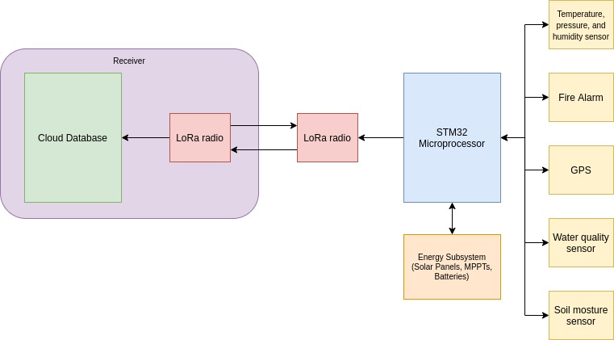

# Imaginary Embedded System: Ecossystem Preservation System

> Tell us about an embedded system that does not exist. It can be grandiose or strange; it can be something just one step beyond what you have around you. Ideally it is something you
personally want to build (even if physics doesn’t allow it). What is it? What does it do? What
general components do you need?

## Motivation

Brazil holds a large ecosystem diversity with several biomes. But, nowadays, we live an expansion of deforestation, illegal mining, and illegal fires.  The authorities have difficulty in identifying the environmental crimes due to the large land extension of the country. Therefore, an IoT device would be excellent to alert the authorities and NGOs about illegal activities.

## The Device

This device must be reasonably cheap and autonomous. It intends to identify deforestation, illegal mining, and illegal fires so it must have temperature, pressure, and humidity sensors, a fire alarm, a GPS, and a LoRa radio (due to the lack of internet on the dense forests). To maintain the autonomy of the device, the device must charge with solar panels. 

A specialized version of the device can be built to avoid illegal mining. This version would accommodate a water quality sensor to identify the presence of mercury on the rivers and a soil moisture sensor.

The information would be sent through LoRa modulation to a receiver. This receiver would update all data to a cloud database that would be accessed through a public API. Websites and social media could consume this API and create alerts to authorities and the population.

## Diagram

